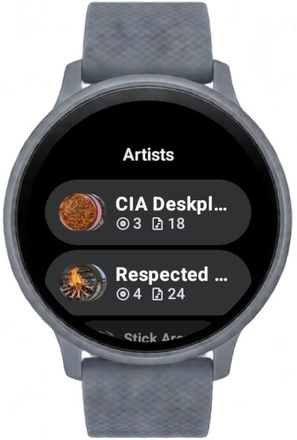
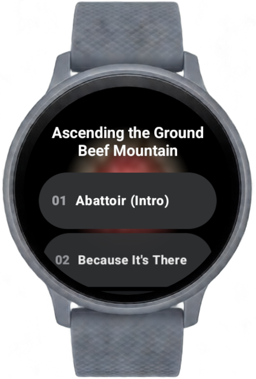
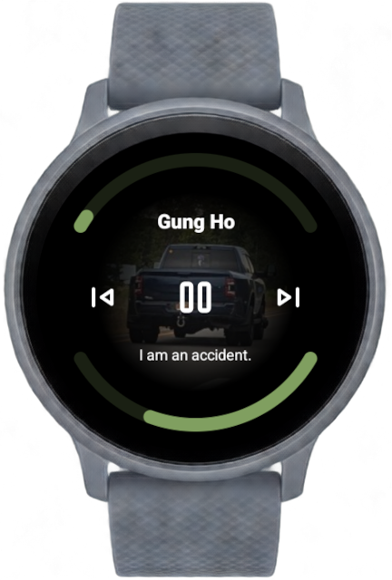
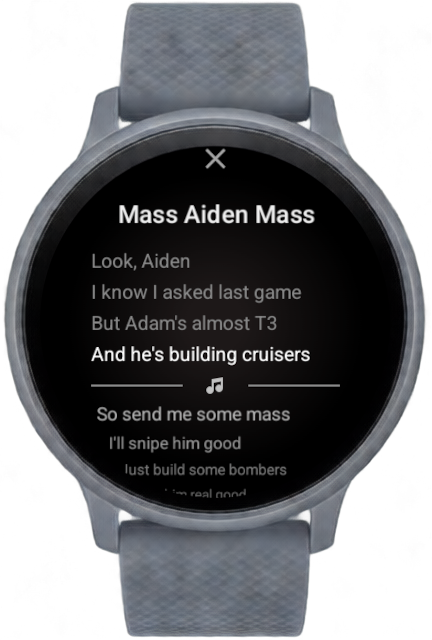

# Cassette

<div align="center">
  
  
  
  
</div>

**Cassette is BETA software. I'm pretty sure I squashed the bug where it would suddenly play things at 4x volume, but use with caution**

A local music player for Wear OS, inspired by [Vinyl](https://github.com/VinylMusicPlayer/VinylMusicPlayer)

## Features

- Dedicated tile to play ["the unquestioned apex of the entire history of the creative arts"](https://theonion.com/humanity-still-producing-new-art-as-though-megadeth-s-1819578062/)\*. No, you can't change what it does.

Wait, you wanted more features? Uh, here:

- ReplayGain 2.0 support w/ optional preamp
- LRC synchronized lyrics support (mostly)
- Inline and dedicated lyrics views
- Ambient Mode (always-on display) support
- Extensive, app-wide crown/rotary input support
- A very pretty loading view while you wait for jaudiotagger to ponder its way through your songs
- Extensive optimizations to lower CPU and memory usage while delivering a rich UI
- I read through the Material 3 guidelines halfway through development, so it might follow that

## Library Format Recommendations

Cassette currently has good support for music in ogg containers
(`.ogg`/`.opus`/`.flac`) and will search for audio files in
`/storage/emulated/0/Music`. It'll play any audio Android supports, but tag
support for mp3/m4a is a crapshow right now. WAV and AIFF tag support is also
non-existent, but if you're loading uncompressed audio onto your smartwatch,
that's your own fault.

Cassette's UI design relies heavily on your music's album art for its UI colors,
so it is recommended that you include art for each of your albums. You can embed
it in your music files, but placing it in the same directory with the name
`cover.jpg` is recommended, because it's not duplicated across tracks.

Cassette lazily loads the actual file whenever it needs to display
high-resolution album art, so you should downscale your album art to a
reasonable size before loading it onto your watch. You can do this with
imagemagick like so:

```bash
find -name "cover*" | parallel "mogrify -resize 384x384 {}"
```

Lyrics are extracted from either the LYRICS or UNSYNCEDLYRICS tag embedded in
each track. Discrete .lrc files aren't currently supported (and they might need
`READ_EXTERNAL_STORAGE` so I'm not sure if they will be)

## Battery Usage

Cassette goes to great lengths to avoid using more resources than it needs to,
but simply the act of playing audio and streaming it over Bluetooth is quite
intensive for watch hardware. 95+ percent of CPU time attributable to Cassette
during playback is spent in ExoPlayer and Android-native services.

- 30-50% - Native Audio Service (android.hardware.audio.service)
- 20-30% - ExoPlayer (in the Cassette process)
- 10% - Native Opus decoder (old.media.swcodec)
- 10% - Native Audio server (audioserver)
- ~2% - Cassette UI updates (lyrics, progress, animations)

The one feature that you can disable to improve the situation is ReplayGain,
which makes the hardware audio service hover closer to 30% than 50%. However, If
you don't have a "pro" watch with a 500mAh+ cell, your battery will disappear
faster than beer at a frat house and I can't really do anything about that.

## Requirements

- API Level 34 (Wear OS 5)
- Anything "faster" than a single Cortex-A53 @ 1GHz (below may experience choppy playback)

## Usage

The overall UI layout can be seen below:

```
        Song Info (NYI)
            |
Library - Player - Play Queue (NYI)
            |
          Lyrics
```

You can swipe between the views naturally, and swiping back should behave as you
expect in all views. 

Crown input in the player view controls playback volume, and it scrolls
everywhere else. Steppers in the settings can also be controlled with the crown.

## Planned Enhancements

- Playing queue manager
- Song information view
- Better support for mp3 and m4a/aac container tags
- Loading optimizations for the artist list view
- More and more polished tiles
- AutoEQ (if a watch can run a convolver at full speed)
- Support for the *full* lrc spec, such as per-word synchronization
- Complications

\* Not associated with Megadeth or whatever faceless entity holds the rights to Rust in Peace. Or The Onion. Obviously.
